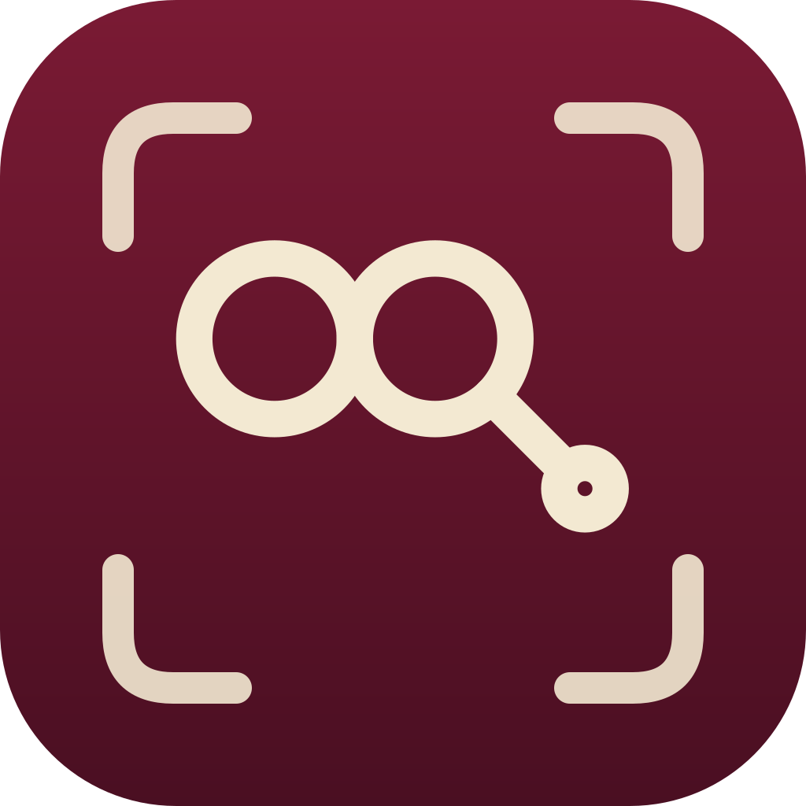

# Loren ("lord" with an n)

Instant screenshot capture with shareable links on your own domain.

Loren is a fork of [Spectacle](https://invent.kde.org/plasma/spectacle) 6.3.5 for KDE Plasma.

## What sets it apart

- **One-click upload.** Launch it, drag a region, and press Upload (or Enter). The image goes to your own server and the link is on your clipboard.
- **Your own domain.** Point it at any server that accepts an upload, such as a small script or a Cloudflare Worker, and set it up in Settings > Upload. Cloudflare Access is supported. See [docs/upload-server.md](docs/upload-server.md).
- **Region first.** Launching opens the region overlay right away.
- **Expiring and deletable links.** Choose how long a link lasts, and delete an upload from the "link copied" message.
- **Screen recordings too.** Finish a recording, press Upload, and the video link is on your clipboard.
- **Runs alongside Spectacle.** It has its own name, icon and settings, so both can be installed together.

## Install

Download `loren_1.0.0_amd64.deb` from the [latest release](https://github.com/amandoti-win/loren/releases/latest) and install it. It is a ready-made program, so there is nothing to compile, and apt installs everything it needs:

    sudo apt install ./loren_1.0.0_amd64.deb

Then log out and back in once, so KDE picks up Loren's shortcuts (Print launches it if nothing else has the key).

This is for Debian, Ubuntu and derivatives with KDE Plasma 6 on Wayland. On other distributions, build it from source.

## Build from source

Needs Qt 6.7+ and KDE Frameworks 6.10+ development packages. On Debian 13:

    sudo apt install build-essential cmake extra-cmake-modules gettext qt6-base-dev qt6-base-private-dev \
      qt6-declarative-dev qt6-declarative-private-dev qt6-wayland-dev qt6-wayland-private-dev qt6-multimedia-dev \
      qt6-tools-dev libkf6coreaddons-dev libkf6widgetsaddons-dev libkf6dbusaddons-dev libkf6notifications-dev \
      libkf6config-dev libkf6i18n-dev libkf6kio-dev libkf6windowsystem-dev libkf6globalaccel-dev libkf6xmlgui-dev \
      libkf6guiaddons-dev libkirigami-dev libkf6statusnotifieritem-dev libkf6prison-dev libkf6crash-dev \
      libkf6purpose-dev libkpipewire-dev liblayershellqtinterface-dev plasma-wayland-protocols libwayland-dev \
      libopencv-dev libxcb-xfixes0-dev libxcb-image0-dev libxcb-util-dev libxcb-cursor-dev libxcb-randr0-dev \
      libxcb-shape0-dev

Then build and install it:

    cmake -S . -B build -DCMAKE_BUILD_TYPE=Release -DCMAKE_INSTALL_PREFIX=/usr
    cmake --build build -j$(nproc)
    sudo cmake --install build

## Why it has to be installed

On Wayland, KWin only lets a program capture the screen if the program is named in an installed desktop file. The `.deb` and `cmake --install` install that file, which is why there is nothing to set up. A copy run straight from a build folder, or a binary you just downloaded and ran, is refused with "The process is not authorized to take a screenshot".

To run a copy from somewhere else, create `~/.local/share/applications/win.amandoti.loren.desktop` with the full path to that copy:

    [Desktop Entry]
    Type=Application
    Name=Loren
    Exec=/full/path/to/loren
    NoDisplay=true
    X-KDE-DBUS-Restricted-Interfaces=org.kde.KWin.ScreenShot2
    X-KDE-Wayland-Interfaces=org_kde_plasma_window_management,zkde_screencast_unstable_v1

Then run `kbuildsycoca6` and start Loren again. The path has to match the copy you run.

Tested on KDE Plasma 6 on Wayland (Debian 13). X11 and other distributions are untested.

## Credits and license

Loren is a fork of KDE Spectacle. Spectacle's authors and their copyright notices are kept in the source files and the About dialog. The original README is in `README.spectacle.md`.

Loren is GPL-3.0-or-later (`LICENSE`). Spectacle files keep their own headers, mostly LGPL-2.0-or-later, which allows this. New files are GPL-3.0-or-later.

The icon was drawn for this project and has no third-party artwork.

## AI disclosure

Built with AI assistance, directed by the maintainer.
